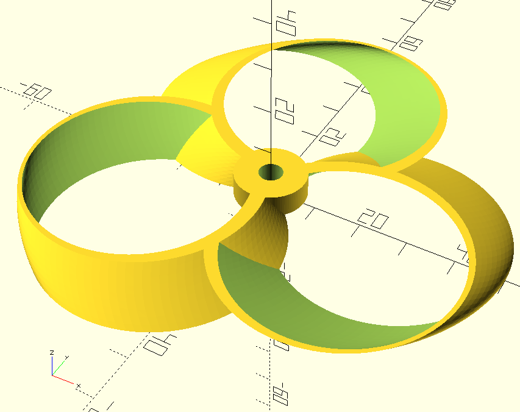
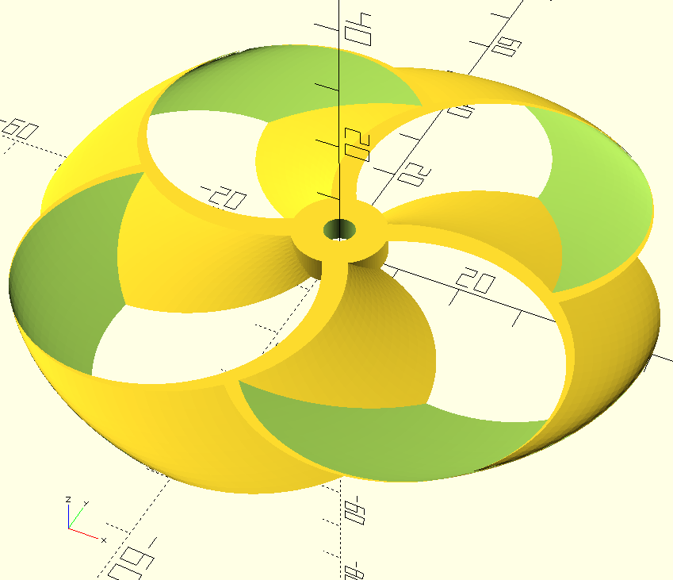
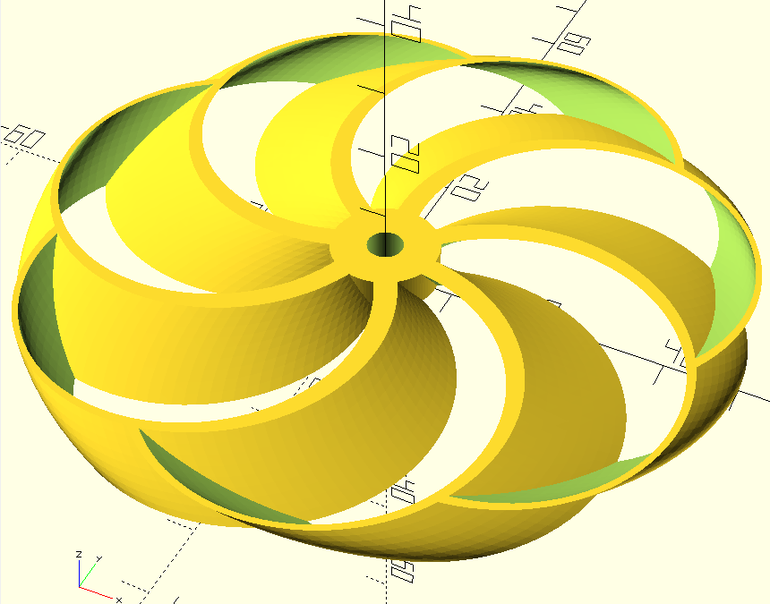
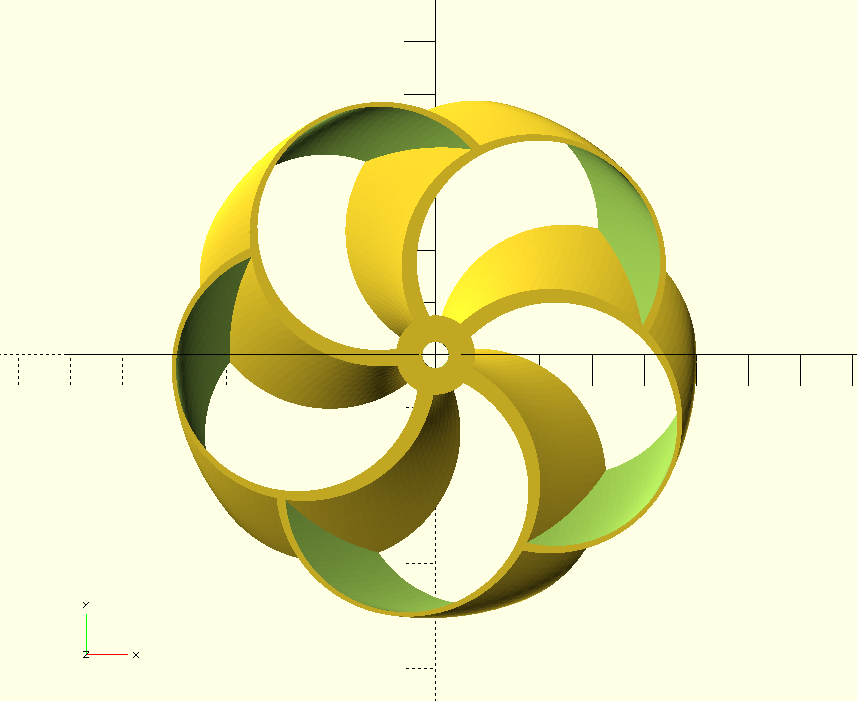
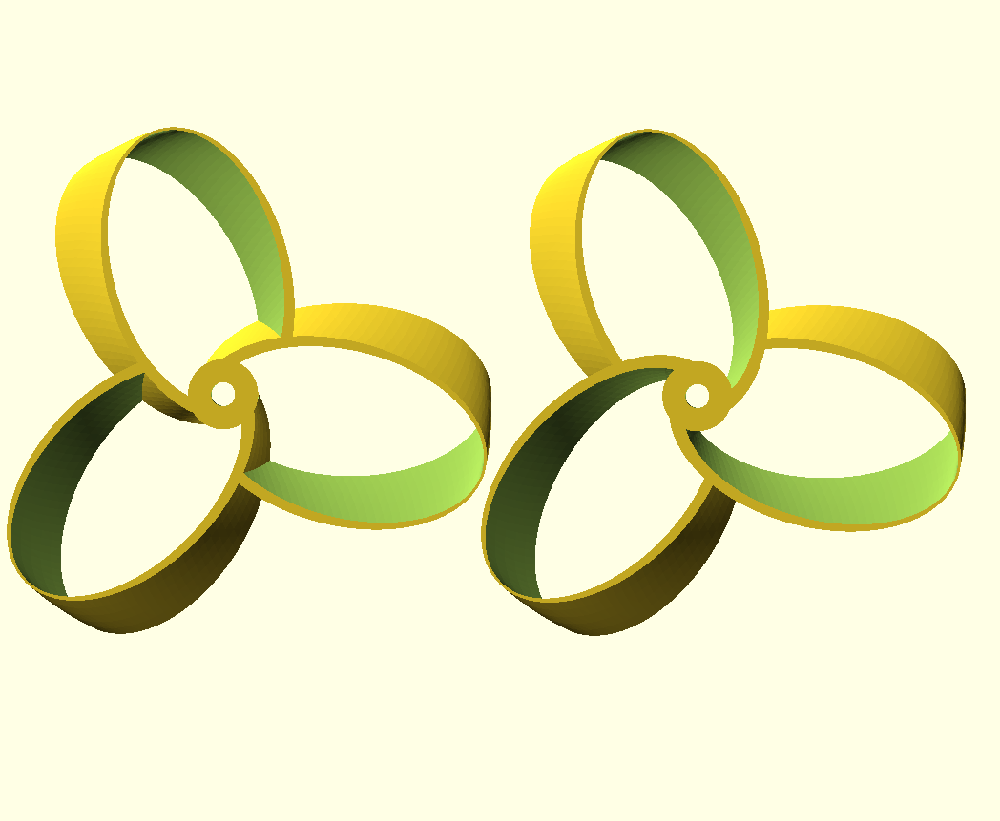
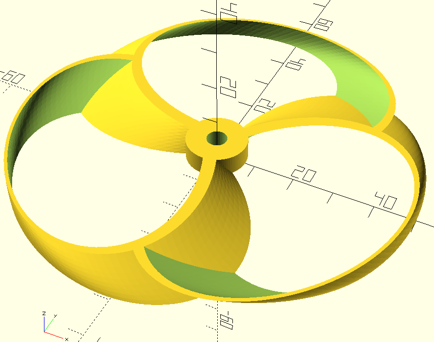

# Ultimate Toroidal Propeller Generator


The Ultimate Toroidal Propeller Generator is an open source project that provides a way to generate STL files of toroidal drone propellers.

|||
|---|---|


## :sparkles: Features
|   |  |  |   |
|---|---|---|---|
|  Multi-blade  |  Safe blades intersections  | Safe blade direction | Highly configurable  |
|  You can create propellers with as many blades as you want  |  Each blade prevents getting into another one  | Customize what to do when one blade gets into another | Create the blade that you need in a simple way  |


## :muscle: Getting started

The Ultimate Toroidal Propeller Generator is meant to be used by anyone and it's not neccessary to code, *BUT* you have to touch some values that are in the code. Don't worry, it's easy and very strightforward. Let's start!

### :arrow_down: Download stuff
Fist of all you have to download several things:

1. This repository [by downloading it](https://github.com/RaulBejarano/Ultimate-Toroidal-Propeller-Generator/archive/refs/heads/main.zip) or by cloning it (we assume that if you use this method you know how to do it). Then unzip the files.
2. [OpenSCAD](https://openscad.org/downloads.html): the sofware we need to render and create our STL files.


### :hammer: Creating our first propeller

Let's start by opening the file `example.scad` with OpenSCAD.

You will see some code but we only are interested in the parameters inside the toroidal definition. Let's change some of them:
  
This defines a propeller:
> :warning: Use milimeters
```
toroidal_propeller(
    blades = 3,                     // number of blades | Default(3)
    height = 6,                     // height | Default(6)
    blade_length = 68,              // blade length | Default(68)
    blade_width = 42,               // blade width | Default(42)
    blade_thickness = 4,            // blade thickness | Default(4)
    blade_hole_offset = 1.4,        // blade hole offset | Default(1.4)
    blade_twist = 15,               // blade twist angle | Default(15)
    blade_offset = -6,              // blade distance from propeller axis | Default(-6)
    safe_blades_direction = "PREV", // indicates if a blade must delete itself from getting into the previous (PREV) or the next blade (NEXT) | Default("PREV")
    hub_d = 16,                     // hub diameter | Default(16)
    hub_screw_d = 5.5,              // hub screw diameter | Default(5.5)
    eh_l = 0,                       // length of the emptying of the hub | Default(0 = [No support])
    eh_d = 0                        // diameter of the hollowing of the hub | Default(0 = [No support])
);
```

- `$fn`: defines the number of facets by default. In other words how smoother the propeller will be. If you are just experimenting we recomend you to comment that line.
- `blades`: just the number of blades you want
- `height`: total propeller height
- `blade_length`: blade lenght or total radius. If you have a 5'' drone set this to 63 (mm).
- `blade_width`: blade width
- `blade_thickness` blade thickness. Be aware of your printer capabilities.
- `blade_hole_offset`: displacement between outer and inner sides of the blades. It shouldn't be greater than thickness.
- `blade_twist`: this sets how is going to be the attack angle. A positive value will generate a CW propeller and a negative one a CCW.
- `blade_offset`: blade distance from propeller axis
- `safe_blades_direction`: indicates if a blade must delete itself from getting into (1) the previous or (2) the next blade.
- `hub_d`: hub or holder diameter.
- `hub_screw_d`: motor axis screw diameter.
- `eh_l`: support hole length.
- `eh_d`: support hole diameter.

That's all! Render it with this values with OpenSCAD and you will get something similar to this:


Now it's your turn. Play with the parameters and try adding more blades, different lengths, attack angles, etc. Let's make something awesome!


## Contributing

Feel free to contribute to this project as much as you want.

:children_crossing: If you are new contributing we recommend you to start by playing with the core design file [`toroidal_propeller.scad`](./src/toroidal_propeller.scad).

:memo: When you see something you want to add, modify or refactor first of all, you should **create a new issue** providing as much information as you can. We will appreciate if you can write as an user story (e.g. `AS [a user persona], I WANT [to perform this action] SO THAT [I can accomplish this goal]`.) 

:twisted_rightwards_arrows: Then you should create a fork of the project, clone it to your local, create a new local branch and you will be ready to start making changes. You'll need a recent version of [OpenSCAD.](https://openscad.org/)

:rocket: When you finish making changes go to [pull requests](https://github.com/RaulBejarano/Ultimate-Toroidal-Propeller-Generator/pulls) and create a new one selecting your fork as source. More info on [GitHub Docs: creating a pull request from a fork](https://docs.github.com/es/pull-requests/collaborating-with-pull-requests/proposing-changes-to-your-work-with-pull-requests/creating-a-pull-request-from-a-fork). Please add as much information as you can explaining what have you done, strategies you followed, which issue resolves, etc.

:speech_balloon: Your PR will be commented, reviewed and, we hope, :tada:**approved and merged into main branch**:tada:.

If you want to contribute but you feel lost with all this process please fell free to contact to any of the mantainers, they will help you a lot.
