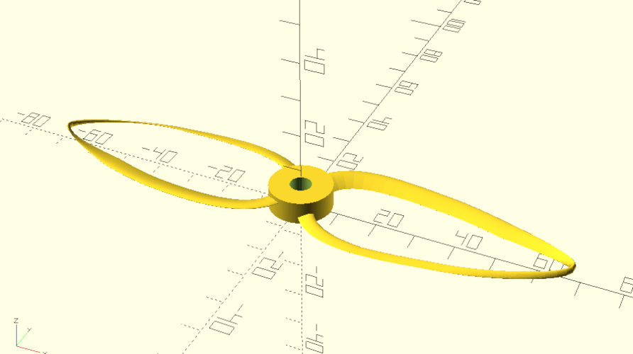
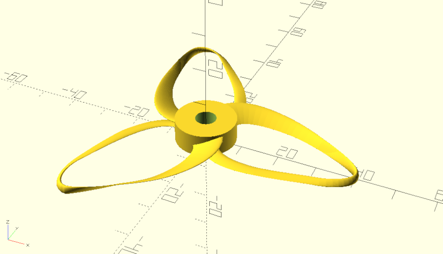
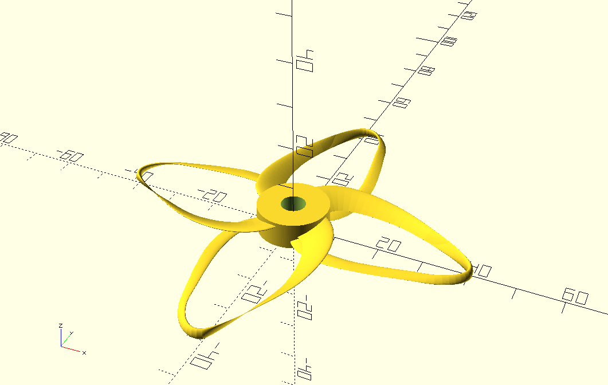
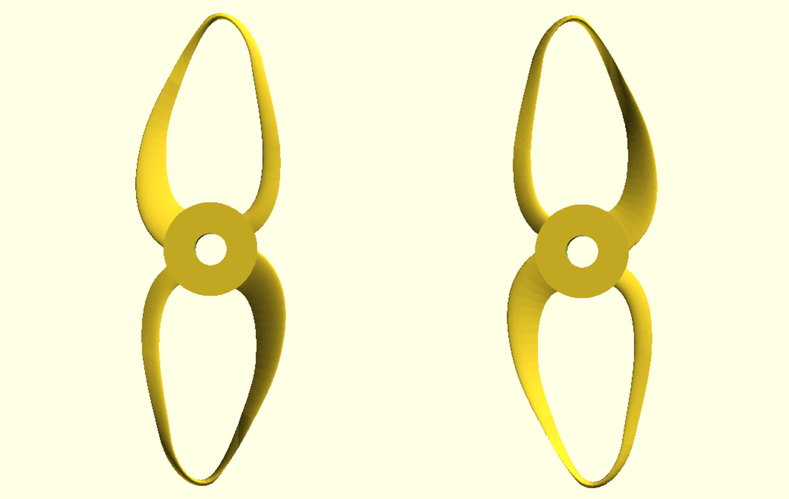
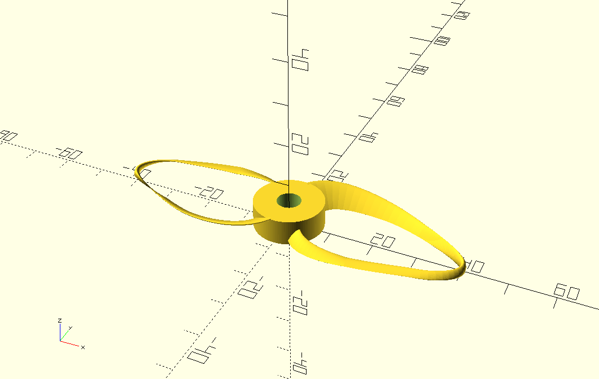
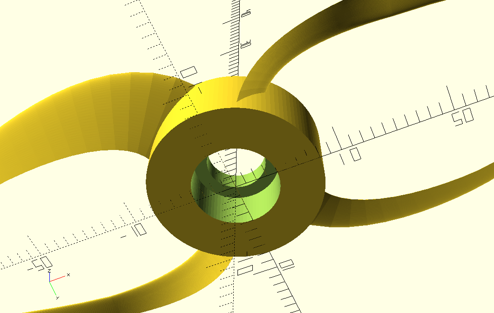
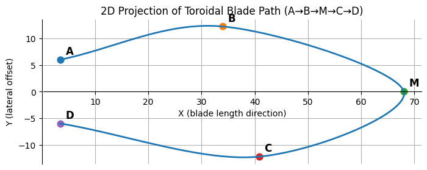

# imate Toroidal Propeller Generator

[](https://github.com/RaulBejarano/Ultimate-Toroidal-Propeller-Generator/releases/latest)
[](https://github.com/RaulBejarano/Ultimate-Toroidal-Propeller-Generator?tab=GPL-3.0-1-ov-file#readme)
[](https://github.com/RaulBejarano/Ultimate-Toroidal-Propeller-Generator/commits/main/)

The Ultimate Toroidal Propeller Generator is an open source project that provides a way to generate STL files of toroidal drone propellers.

|  |  |
| ---------------------------------------- | ---------------------------------------- |

## ✨ Features

|                                  |                                     |                                      |                                            |
| ---------------------------------------------------------- | --------------------------------------------------------- | ---------------------------------------------------------------- | ------------------------------------------------------------- |
| Multi-blade                                                | Configurable propeller rotation: CW or CCW                | Attack angle                                                     | Customizable hub                                              |
| Design propellers with the exact number of blades you need | Specify rotation based on your specific application needs | Define the required blade attack angle in a clear and simple way | Design and customize the hub according to your specific needs |

## 💪 Getting started

The Ultimate Toroidal Propeller Generator is meant to be used by anyone and it's not neccessary to code, *BUT* you have to touch some values that are in the code. Don't worry, it's easy and very strightforward. Let's start!

### ⬇️ Download stuff

Fist of all you have to download several things:

1. This repository [by downloading it](https://github.com/RaulBejarano/Ultimate-Toroidal-Propeller-Generator/archive/refs/heads/main.zip) or by cloning it (we assume that if you use this method you know how to do it). Then unzip the files.
2. [OpenSCAD](https://openscad.org/downloads.html): the sofware we need to render and create our STL files.

### 🔨 Creating our first propeller

Let's start by opening the file `example.scad` with OpenSCAD.

You will see some code but we only are interested in the parameters inside the toroidal definition. Let's change some of them:

This defines a propeller:

```
$fn = 100;  // global tessellation (higher = smoother preview/export)

toroidal_propeller(
    // -------------------------
    // Blade count + rotation
    // -------------------------
    blades = 2,                                                // number of blades (copied/rotated around Z)
    rotation = "CW",                                           // "CCW" (default) or "CW" (mirrored in YZ plane)

    // -------------------------
    // Hub geometry
    // -------------------------
    hub_height = 6,                                            // hub height
    hub_d = 16,                                                // hub outer diameter
    hub_screw_d = 5.5,                                         // center screw hole diameter
    hub_notch_height = 0,                                      // optional notch height (0 = disabled)
    hub_notch_d = 0,                                           // optional notch diameter (0 = disabled)

    // -------------------------
    // Path / blade geometry
    // -------------------------
    blade_length = 40,                                         // blade span/length used by the toroidal path
    blade_offset = 2,                                          // Z offset between leading/trailing halves
    leading_blade_width = 25,                             // leading half width (percent of blade_length)
    trailing_blade_width = 20,                            // trailing half width (percent of blade_length)
    leading_blade_xoffset = 50,                           // leading half X offset (percent of blade_length)
    trailing_blade_xoffset = 80,                          // trailing half X offset (percent of blade_length)

    // -------------------------
    // Airfoil profiles (keyframes along the path)
    // -------------------------
    profiles = ["2412","2412",["ellipse", 0.5],"2412","8412"], // NACA 4-digit or ["ellipse", scale]
    profile_pcts = [0,35,50,87,100],                           // keyframe positions along the path (0..100)
    chords = [8,3,2.5,3,4],                                    // chord length at each keyframe (same order as profiles)
    chord_pivot_pcts = [50,25,100,50,65],                      // pivot along chord: 0=LE, 50=mid, 100=TE
    attack_angles = [15,40,-90,0,10],                          // attack angle (deg) at each keyframe

    // -------------------------
    // Render only part of the path
    // -------------------------
    path_portion = 1.0                                         // 1.0 = full path, 0.5 = half path, etc.
);
```

## Parameters

### Global

- **`$fn`**: Defines the global number of facets used to approximate curves. Higher values produce smoother results but slower previews/exports.

### Blade count + rotation

- **`blades`**: Number of blades replicated around the Z axis.
- **`rotation`**: Sets propeller handedness. Use `"CCW"` (default) or `"CW"` (mirrored across the YZ plane).

### Hub geometry

- **`hub_height`**: Hub (holder) height.
- **`hub_d`**: Hub outer diameter.
- **`hub_screw_d`**: Center hole diameter (motor shaft / screw).
- **`hub_notch_height`**: Optional notch/support hole height. Set to `0` to disable.
- **`hub_notch_d`**: Optional notch/support hole diameter. Set to `0` to disable.

### Path / blade geometry

- **`blade_length`**: Blade span/length used by the toroidal path (controls overall size).
- **`blade_offset`**: Z offset between leading and trailing halves of the blade.
- **`leading_blade_width`**: Controls the **Y coordinate of point B** (leading half), as a percentage of `blade_length`.
- **`trailing_blade_width`**: Controls the **Y coordinate of point C** (trailing half), as a percentage of `blade_length`.
- **`leading_blade_xoffset`**: Controls the **X coordinate of point B** (leading half), as a percentage of `blade_length`.
- **`trailing_blade_xoffset`**: Controls the **X coordinate of point C** (trailing half), as a percentage of `blade_length`.

#### Toroidal Blade Path (Catmull–Rom)

The toroidal blade path is defined by a **Catmull–Rom spline** passing through five control points in the **XY plane**:

`A → B → M → C → D`

The **X axis** is the blade-length direction and the **Y axis** controls the lateral opening of the toroid.

###### Control Points

All points are defined in 3D, but the path shape is governed by their **XY projection**.

 


`r = hub_d · cos(30°) / 2`
`leadX = blade_length · leading_blade_xoffset / 100`
`leadW = blade_length · leading_blade_width / 100`

 - **A — Hub entry** 
 - **B — Leading edge control** 
 - **M — Midpoint** 
 - **C — Trailing edge control** 
 - **D — Hub exit**

```
A = ( r·cos(60°), r·sin(60°), hub_height/2 + blade_offset/2 )
B = ( leadX, +leadW, hub_height/2 )
M = ( blade_length, 0, hub_height/2 )
C = ( trailX, -trailW, hub_height/2 )
D = ( r·cos(60°), -r·sin(60°), hub_height/2 - blade_offset/2 )
```

### Airfoil profiles (keyframes along the path)

- **`profiles`**: Airfoil profile at each keyframe. Accepts NACA 4-digit strings (e.g. `"2412"`) or ellipse definitions like `["ellipse", scale]`.
- **`profile_pcts`**: Keyframe positions along the path (0..100). Must match the order and length of `profiles`.
- **`chords`**: Chord length at each keyframe. Same order as `profiles`.
- **`chord_pivot_pcts`**: Pivot position along the chord: `0` = leading edge, `50` = middle, `100` = trailing edge.
- **`attack_angles`**: Attack angle in degrees at each keyframe. Same order as `profiles`.

### Render control

- **`path_portion`**: Portion of the toroidal path to render (`1.0` = full path, `0.5` = half path, etc).

That's all! Render it with this values with OpenSCAD and you will get something similar to this:


Now it's your turn. Play with the parameters and try adding more blades, different lengths, attack angles, etc. Let's make something awesome!

## Contributing

🚸 If you are new contributing we recommend you to start by playing with the core design file [`toroidal_propeller.scad`](./src/toroidal_propeller.scad).

📝 When you see something you want to add, modify or refactor first of all, you should **create a new issue** providing as much information as you can. We will appreciate if you can write as an user story (e.g. `AS [a user persona], I WANT [to perform this action] SO THAT [I can accomplish this goal]`.)

🔀 Then you should create a fork of the project, clone it to your local, create a new local branch and you will be ready to start making changes. You'll need a recent version of [OpenSCAD.](https://openscad.org/)

🚀 When you finish making changes go to [pull requests](https://github.com/RaulBejarano/Ultimate-Toroidal-Propeller-Generator/pulls) and create a new one selecting your fork as source. More info on [GitHub Docs: creating a pull request from a fork](https://docs.github.com/es/pull-requests/collaborating-with-pull-requests/proposing-changes-to-your-work-with-pull-requests/creating-a-pull-request-from-a-fork). Please add as much information as you can explaining what have you done, strategies you followed, which issue resolves, etc.

💬 Your PR will be commented, reviewed and, we hope, 🎉**approved and merged into main branch**🎉.

If you want to contribute but you feel lost with all this process please fell free to contact to any of the mantainers, they will help you a lot.
